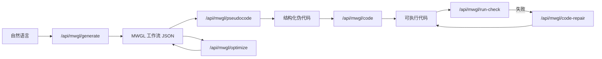

# MWGL Studio v3

面向 **MWGL（Minimal Workflow Graph Language）** 的工作流可视化工作台：自然语言 → 流程图 → 伪代码 → 可执行代码，并支持约束校验、Top-2 优化与运行检测/自动修复。

## 目录

- [快速开始](#快速开始)
- [端到端流程](#端到端流程)
- [MWGL v3 简介](#mwgl-v3-简介)
- [项目结构](#项目结构)
- [前端使用](#前端使用)
- [环境变量](#环境变量)
- [API 速查](#api-速查)
- [Top-2 优化](#top-2-优化)
- [评测数据](#评测数据)
- [脚本命令](#脚本命令)
- [常见问题](#常见问题)

## 快速开始

前端与后端**同一进程**：`server.js` 托管静态页面并暴露 API，无需单独 `npm run dev` 或 Vite。

```bash
cd /path/to/MWGL
npm install
cp .env.example .env
# 编辑 .env，至少填入 DEEPSEEK_API_KEY
npm start
```

浏览器打开 **http://localhost:3001**（端口由 `.env` 中 `PORT` 控制，默认 `3001`）。

| 地址 | 说明 |
|------|------|
| http://localhost:3001 | 前端 Studio（`index.html`） |
| http://localhost:3001/api/health | 健康检查（是否配置 Key） |

**运行代码自检**（可选）需本机安装对应工具链：`python3`（Python）、`node`（JavaScript）、`javac`/`java`（Java）、`go`（Go）、`g++`（C++）。

> 不要用 `file://` 直接打开 `index.html`，否则模块与 API 请求会失败。

## 端到端流程



| 阶段 | 实现要点 |
|------|----------|
| NL → DAG | DeepSeek 单次生成 + 校验与自动修复重试 |
| DAG → 伪代码 | LLM **逐节点润色** + 程序按图 **确定性拼装**（含 `# [nodeId]`） |
| 伪代码 → 代码 | LLM **逐节点函数** + 程序拼装 `main`；`workflow` 必填 |
| 运行检测 | Python：`py_compile` + 执行；JS：`node --check` + 执行；Java：`javac` + `java`；Go：`go run`；C++：`g++` + 执行 |
| 报错修复 | 将 `run-check` 结果回传 LLM，默认最多 2 轮（`MWGL_CODE_REPAIR_MAX_RETRY`） |

## MWGL v3 简介

MWGL 用**有向图**表示业务流程：

- **节点**（4 类）：`start` | `step` | `branch` | `end`
- **边**：顺序或分支；`branch` 多出边的 `label` 为条件文案
- **循环**：挂在 `step.loop`（`loop.steps` 树 + 可选 `subworkflows`），**不写入主图 edges**，保证主图仍为 DAG

设计目标：**可读**、**可校验**、**可映射**到伪代码与代码。导入的 v2 JSON 会在 `normalizeWorkflow` 时自动迁移为 v3。

### 节点类型

| type | 含义 | 出边 |
|------|------|------|
| `start` | 唯一入口 | ≥1 |
| `step` | 顺序动作（可含 `loop`） | ≤1 |
| `branch` | 条件分支 | ≥2，label 非空且不重复 |
| `end` | 终态 | 0；须 `outcome`: `success` \| `failure` |

### 最小示例

```json
{
  "mwgl_version": 3,
  "rule_id": "R_demo",
  "rule_name": "示例",
  "nodes": [
    { "id": "n_start", "type": "start", "text": "开始", "x": 120, "y": 180 },
    { "id": "n_end", "type": "end", "outcome": "success", "text": "完成", "x": 520, "y": 180 }
  ],
  "edges": [
    { "id": "e_1", "from": "n_start", "to": "n_end", "label": "" }
  ]
}
```

### 校验要点

- 全图 DAG；唯一 `start`；可达非 `end` 节点须能到达某个 `end`
- `end` + `failure` 文案须具体（禁单独写「失败」）
- `branch` 出边 label 须有业务语义（禁纯数字 / `分支N`）

## 项目结构

```text
.
├── index.html, styles.css, js/     # 前端（画布、高亮、API 调用）
├── server.js                       # Express：静态资源 + API
├── routes/
│   ├── skill1-nl2dag.js            # 自然语言 → workflow
│   ├── skill2-dag2pseudo.js        # 逐节点润色 + 拼装伪代码
│   ├── skill3-pseudo2code.js       # 逐节点函数 + 拼装主函数
│   ├── code-repair.js              # 根据运行报错修复代码
│   ├── run-check.js                # 代码语法 + 运行自检
│   ├── optimize.js                 # Top-2 优化
│   ├── workflow-suggestions.js     # 首图人工修订建议
│   └── …
├── lib/
│   ├── mwgl-top4-search.mjs        # 束搜索 / MCTS（API 字段名仍为 top4_*）
│   ├── mwgl-generate-validate.mjs
│   ├── mwgl-graph-utils.mjs
│   ├── mwgl-pseudo-assembler.mjs   # 伪代码确定性拼装
│   ├── mwgl-pseudo-parse.mjs       # 伪代码 → 逐节点 map
│   ├── mwgl-code-lang.mjs          # 多语言代码模板
│   ├── mwgl-code-assembler.mjs     # main + 逐节点函数拼装
│   ├── mwgl-loop-summary.mjs
│   ├── run-check-runner.mjs
│   └── mwgl-graph-edit-*.mjs       # 可选图编辑距离
├── js/mwgl-v3.js                   # 校验、归一化、MWGL 文本
├── data/eval_dataset.jsonl         # 评测集
└── tools/, scripts/
```

## 前端使用

侧栏「后端地址」默认为 `http://localhost:3001`，须与 `npm start` 端口一致。

### 工具栏快捷操作

| 按钮 | 作用 |
|------|------|
| 操作方式 | 六种：重新生成/增量优化 工作流、伪代码、代码 |
| 执行当前方式 | 按所选方式执行（原「生成工作流」主按钮） |
| 生成伪代码 / 生成代码 | 须与下拉「操作方式」一致 |
| 生成伪代码 | DAG → 伪代码（右侧「伪代码」Tab） |
| 生成代码 | 伪代码 → 代码（需已生成伪代码） |
| 运行自检 | 语法 + 执行检测；失败时**自动修复**（最多 2 轮） |
| 根据报错修复 | 手动再跑「检测 → LLM 修复」 |
| Top-2 优化 | 生成后优化（需 `QWEN_*`，见下文） |

### 伪代码 / 代码高亮

「伪代码」「代码」Tab 按**节点**背景色区分段落（与画布 `start/step/branch/end` 配色一致），悬停可看节点 id；顶部为图例。

### 画布快捷键

- 拖拽节点移动；拖拽空白平移画布
- `Ctrl + 滚轮` 缩放
- `Shift + 拖节点` 快速连线
- 选中边后 `Delete` 删除

### Top-2 与首图修订

开启「Top-2 优化」时，选择 **重新生成工作流** 后必经：**① 初次修改** → **② 最终确认（补充意见）** → 再补初池并搜索（不可跳过，无单独按钮）。

## 环境变量

复制 `.env.example` 为 `.env` 后配置：

| 变量 | 必填 | 说明 |
|------|------|------|
| `DEEPSEEK_API_KEY` | 是 | 生成 / 伪代码 / 代码 / 修复 |
| `DEEPSEEK_API_BASE` | 否 | 默认 `https://api.deepseek.com/v1` |
| `PORT` | 否 | 默认 `3001` |
| `CORS_ORIGIN` | 否 | 默认 `*` |
| `QWEN_API_KEY` | 优化时 | Top-2 第 1+ 轮整图改写 |
| `QWEN_BASE_URL` | 优化时 | 如 DashScope 兼容地址 |
| `QWEN_MODEL` | 否 | 默认 `qwen-turbo` |
| `MWGL_GENERATE_MAX_RETRY` | 否 | `/generate` 校验失败重试，默认 `3` |
| `MWGL_CODE_REPAIR_MAX_RETRY` | 否 | 代码修复轮数，默认 `2` |

**图编辑距离**（Top-2 打分默认混入，可用 `MWGL_GRAPH_EDIT_EVAL=0` 关闭）：

默认开启；`MWGL_GRAPH_EDIT_WEIGHT=0.2`、`ROBUSTFLOW_ROOT` — 见 [Top-2 优化](#top-2-优化) 与 `tools/requirements-graph-edit.txt`。

## API 速查

| 方法 | 路径 | 说明 |
|------|------|------|
| GET | `/api/health` | 服务与 Key 状态 |
| POST | `/api/mwgl/generate` | 自然语言 → workflow JSON |
| POST | `/api/mwgl/workflow-suggestions` | 首图修订建议 |
| POST | `/api/mwgl/pseudocode` | workflow → 伪代码 |
| POST | `/api/mwgl/code` | 伪代码 + **workflow** → 代码 |
| POST | `/api/mwgl/run-check` | 语法 + 运行检测 |
| POST | `/api/mwgl/code-repair` | 根据 `checkResult` 修复代码 |
| POST | `/api/mwgl/optimize` | Top-2 优化 |
| GET | `/api/mwgl/eval-dataset` | 读取评测集 |

### `POST /api/mwgl/generate`

```json
{ "prompt": "用自然语言描述业务流程" }
```

返回 `{ "content": "{...workflow json...}" }`。服务端解析、归一化、硬校验；失败自动重试，仍失败返回 `422` + `details`。

### `POST /api/mwgl/pseudocode`

```json
{ "workflow": { "mwgl_version": 3, "nodes": [], "edges": [] } }
```

返回 `{ "content": "...", "mainFlow": "...", "nodeFiles": { "节点id": "..." } }`。

v3：**main.flow** 由程序按图边关系确定性生成（`CALL` / `IF` / `PARALLEL`，只描述怎么串）；每个节点单独一次 LLM 调用生成 `--- id.pseudo ---` 正文（做什么，循环体 `FOR/WHILE` 由程序展开）。`content` 为二者序列化，供编辑器展示。

### `POST /api/mwgl/code`

```json
{
  "pseudocode": "BEGIN WORKFLOW ...",
  "workflow": { "mwgl_version": 3, "nodes": [], "edges": [] },
  "language": "Python"
}
```

支持 `Python`、`JavaScript`、`Java`、`Go`、`C++`（**运行检测**五种语言均支持，需本机安装对应编译器/解释器）。从 `nodeFiles` / `--- id.pseudo ---` 解析描述后**逐节点** LLM 生成 `node_*` 函数；`main` 由程序按工作流图确定性拼装（与 `main.flow` 结构一一对应）。可选请求体字段：`mainFlow`、`nodeFiles`。

### `POST /api/mwgl/run-check`

```json
{ "code": "...", "language": "Python" }
```

返回 `passed`、`syntaxOk`、`exitCode`、`stdout`、`stderr`、`checks[]`。

### `POST /api/mwgl/code-repair`

```json
{
  "code": "...",
  "language": "Python",
  "checkResult": { "passed": false, "stderr": "...", "checks": [] },
  "pseudocode": "可选，供修复时保持语义"
}
```

返回 `{ "content": "修复后完整代码" }`。前端在生成代码或「运行自检」失败后会自动调用。

### `POST /api/mwgl/optimize`

需 `DEEPSEEK_API_KEY` + `QWEN_*`。请求体示例（与前端默认束搜索一致）：

```json
{
  "prompt": "业务描述",
  "initial_workflow": { "mwgl_version": 3, "nodes": [], "edges": [] },
  "eval_dataset": [],
  "config": {
    "algorithm": "top4",
    "top4_search_mode": "beam",
    "top4_initial_pool": 4,
    "top4_keep": 2,
    "top4_rounds": 2,
    "eval_topk": 24,
    "retrieval_mode": "faiss"
  }
}
```

MCTS：`top4_search_mode": "mcts"`，可选 `top4_mcts_extra_rounds`、`top4_mcts_exploration`。

返回 `best_workflow`、`best_score`、`history`、`explain` 等。打分逻辑见 `routes/optimize-scoring.js`（结构分、需求分、prompt 贴合、规模惩罚；可选图编辑混合）。

## Top-2 优化

| 轮次 | 行为 |
|------|------|
| 第 0 轮 | 用户定稿种子 + DeepSeek 并行补 **3** 张（初池共 4）→ 打分 → 保留 **top2** |
| 第 1+ 轮 | 对每个父代 Qwen **双路**改写：content（文案）/ structure（拓扑） |
| 输出 | 全程 `globalBest`（历史最高分） |

| 模式 | 说明 |
|------|------|
| **束搜索**（默认） | 每轮对当前 top2 全部扩邻 |
| **MCTS** | UCT 选约 2 个父代扩邻 |

**图编辑距离**（默认开启）：将 RobustFlow 图 F1 按权重混入 `score`；`MWGL_GRAPH_EDIT_EVAL=0` 可关闭。依赖 `../RobustFlow` 与 `pip install -r tools/requirements-graph-edit.txt`（未配置时跳过图编辑项，不中断优化）。

本仓库**未集成**独立项目 `MWGL-Robust` 的「生成期多温度并行选优」；若需要请自行对接该服务。

## 评测数据

`data/eval_dataset.jsonl` 供优化与评测使用。任务描述来源 **[Chat2Workflow](https://github.com/zjunlp/Chat2Workflow)**（[论文](https://arxiv.org/abs/2604.19667)），引用请遵守原许可。

| 命令 | 作用 |
|------|------|
| `npm run validate:eval-dataset` | 校验格式 |
| `npm run localize:eval-dataset-zh` | 中文化并写入 `expected` |
| `npm run refresh:eval-expected` | 仅刷新 `expected` |

## 脚本命令

| 命令 | 说明 |
|------|------|
| `npm start` | 启动前后端 |
| `npm run validate:eval-dataset` | 校验评测集 |
| `npm run localize:eval-dataset-zh` | 评测集中文化 |
| `npm run refresh:eval-expected` | 刷新 expected |
| `npm run faiss:check` | FAISS 选样测试 |
| `npm run run:optimize` | 调用优化 API，结果写入 `data/optimize_result.json` |

## 推荐使用顺序

1. `npm start`，浏览器打开 Studio，确认左下角 API 已连接  
2. 输入需求 → **生成工作流** → 画布微调  
3. （可选）Top-2 优化：完成首图两轮确认后再搜索  
4. **生成伪代码** → **生成代码**（自动运行检测，失败则自动修复）  
5. 必要时 **运行自检** / **根据报错修复**  
6. 导出 MWGL / JSON 前查看约束面板  

## 常见问题

| 现象 | 处理 |
|------|------|
| 页面空白或 API 失败 | 必须用 `http://localhost:PORT` 访问，不要 `file://` |
| 生成报错 | 检查 `DEEPSEEK_API_KEY`、`DEEPSEEK_API_BASE` |
| 优化报错 requires Qwen | 配置 `QWEN_API_KEY`、`QWEN_BASE_URL`、`QWEN_MODEL` |
| 运行检测失败 | 看「运行日志」Tab；确认本机已安装对应工具链（见上文）；可点「根据报错修复」 |
| 代码修复后仍失败 | 增大 `MWGL_CODE_REPAIR_MAX_RETRY` 或手动改代码 / 重新生成 |
| 约束不通过 | 侧栏约束列表；`branch` label 要有语义；`failure` end 文案要具体 |
| 图编辑报错 | 检查 `ROBUSTFLOW_ROOT` 与 Python 依赖，或 `lexical_fallback: true` |

---

**MWGL Studio v3** — 最小图语言 + 可视化编辑 + LLM 辅助生成与优化 + 可执行代码落地。
